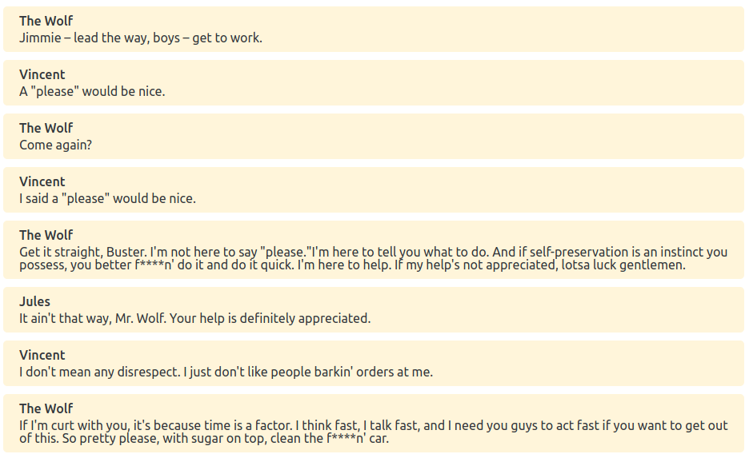

# Clyde - Dialogue Language

Clyde is a language for writing game dialogues. It supports branching dialogues, translations and interfacing with your game through variables and events.

It was heavily inspired by [Ink](https://github.com/inkle/ink), but it focus on dialogues instead of narratives.

You can play with the online editor [here](https://viniciusgerevini.github.io/clyde/).

Here is a simple dialogue:
```

The Wolf:   Jimmie – lead the way, boys – get to work.
Vincent:    A "please" would be nice.
The Wolf:   Come again?
Vincent:    I said a "please" would be nice.
The Wolf:   Get it straight, Buster. I'm not here to
            say "please."I'm here to tell you what to
            do. And if self-preservation is an
            instinct you possess, you better f****n'
            do it and do it quick. I'm here to help.
            If my help's not appreciated, lotsa luck
            gentlemen.
Jules:      It ain't that way, Mr. Wolf. Your help is
            definitely appreciated.
Vincent:    I don't mean any disrespect. I just don't
            like people barkin' orders at me.
The Wolf:   If I'm curt with you, it's because time is
            a factor. I think fast, I talk fast, and I
            need you guys to act fast if you want to
            get out of this. So pretty please, with
            sugar on top, clean the f****n' car.
```
This dialogue results in something like this:




This is just a simple example. There are many features not included above like branching, variations, tags and ids.

You can read the complete language definition with examples on [LANGUAGE.md](./LANGUAGE.md).

## Tools

### Interpreters and parsers

There are three Node libraries which can be used to play with this language:

[@clyde-lang/parser](./parser): Parses Clyde strings to JSON.

[@clyde-lang/interpreter](./interpreter): An interpreter that can be used by Node and web applications.

[@clyde-lang/cli](./cli): CLI tool for executing, parsing and debugging Clyde dialogues.


### Clyde Godot plugin

Godot plugin with importer and interpreter features. It was written completely in GDScript, so it does not require any external dependency. More information in its [repository](https://github.com/viniciusgerevini/godot-clyde-dialogue).


### Standalone Editor and Interpreter

There is a desktop version for the same editor/interpreter used in the [playground page](https://viniciusgerevini.github.io/clyde/).

The desktop version has a few extra features, such as saving direct to the disk and being able to watch files for changes. Check the [desktop folder](./desktop) for more information about features.

Besides that, you can use this editor also like a CLI tool, for compiling your files.


###  Syntax highlighting

I originally created the editor for the demo page, but I know no custom editor would be better than your editor of choice. With that in mind here are some syntax highlighting plugins:

[Vim/Neovim](https://github.com/viniciusgerevini/clyde.vim) syntax highlighting.


