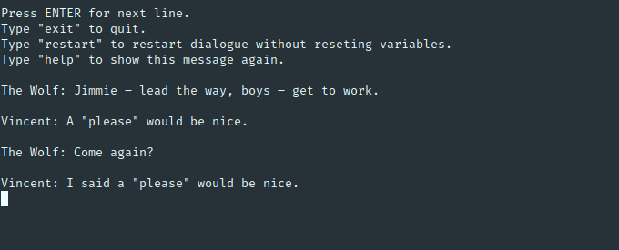

# Clyde CLI

CLI tool for executing, parsing and debugging [Clyde](https://github.com/viniciusgerevini/clyde) dialogues.



## Usage

```
clyde <command>

Commands:
  clyde run    Command line interpreter
  clyde parse  Transforms *.clyde files to *.json

Options:
  --version  Show version number                                       [boolean]
  --help     Show help                                                 [boolean]
```

Interpreter:

```
Usage: clyde run [options] <file path>

Options:
  -b, --block        Provide block name to run.                         [string]
  -f, --file         Path to .clyde or .json dialogue file              [string]
  -t, --translation  Path to .csv dictionary file                       [string]
  -s, --save-data    Path to persist data to be used across executions  [string]
  -p, --persistent   Do not clear screen on every line                 [boolean]
  -d, --debug        Show information about internal state             [boolean]
  -v, --verbose      Run with verbose logging                          [boolean]
      --help         Show help                                         [boolean]
      --version      Show version number                               [boolean]
```

Parser:

```
clyde parse <source file path> <output file path>
clyde parse -i <input> -o <output>

Options:
      --version       Show version number                              [boolean]
  -i, --input         Path to .clyde dialogue file                      [string]
  -o, --output        Path to output .json file. Default: <input>.json  [string]
  -b, --batch         Parse multiple files at same time                  [array]
      --batch-output  Path output names for batched files result. Should have sa
                      me number of arguments as in --batch.              [array]
  -d, --dry-run       Do not generate output file. Only check for syntax errors.
                                                                       [boolean]
      --help          Show help                                        [boolean]
```


## Instalation

```shell
npm install -g clyde-cli
```
